# GAMES101 — Introduction to Computer Graphics

> All nine programming assignments of **GAMES101** (Lingqi Yan, UC Santa Barbara),
> implemented from scratch as **CPU / software renderers + a mass-spring simulator** in
> C++ — an independent, from-skeleton build that is part of a
> [csdiy.wiki](https://csdiy.wiki/) full-catalog effort.


-brightgreen)


## Overview

GAMES101 walks through the full modern graphics pipeline: transforms → rasterization →
shading → geometry → ray tracing → global illumination → physical simulation. This repo
implements **all nine assignments (A0–A8)** as real, self-contained software: eight CPU
renderers plus a headless mass-spring rope simulator. Everything runs on the CPU and writes
an actual PNG (or measured numbers) to `results/` — no GPU, no OpenCV highgui, no fabricated
images. Linear algebra uses **Eigen** (as in the official framework); image load/save uses
the header-only **stb** libraries in place of OpenCV, so it renders headless.

## Results (measured on Windows, AMD CPU, 16 threads, g++ 14.2 `-O2`)

| # | Assignment | What it does | Measured result |
|---|---|---|---|
| A0 | Transform | rotate a point 45° then translate, homogeneous matrices | P(2,1) → **(1.7071, 4.1213)** |
| A1 | MVP + triangle | model/view/projection, viewport, wireframe triangle | verts project symmetrically → 591/350/109 px |
| A2 | Rasterizer | z-buffer occlusion + 2×2 MSAA | **969** anti-aliased edge pixels (0 without MSAA) |
| A3 | Shading | Blinn-Phong + texture/bump/displacement on Spot | **5856** tris, 1024² texture, 5 shaders, ~1.7 s |
| A4 | Bézier | de Casteljau vs Bernstein cross-check | max disagreement **1.26e-4 px** over 2000 samples |
| A5 | Whitted RT | ray-sphere/triangle, Fresnel reflect+refract, shadows | 1280×960, recursion depth ≤ 5, ~1.6 s |
| A6 | BVH | median-split BVH vs brute force | **~195–470× speed-up** (identical hits), build 11711 nodes / depth 13 |
| A7 | Path tracing | Cornell box, next-event estimation, Russian roulette | 512×512 @ **256 spp** in ~40 s (16 threads) |
| A8 | Mass-spring rope | Euler (explicit/semi-implicit) + Verlet, 21-node rope, both ends pinned | explicit **→ non-finite by step 587** (1e30+); semi-implicit + Verlet both settle to a catenary, **sag = 1.7659** (agree to 4 dp) |

### A7 — Cornell box (Monte-Carlo global illumination)

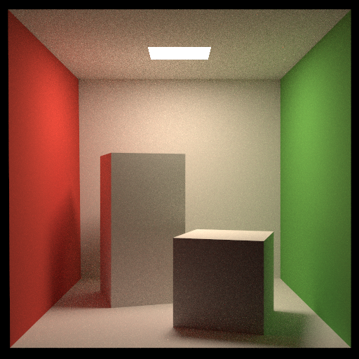

Color bleeding (red/green onto the boxes and floor), soft shadows, and diffuse
inter-reflection — 512×512, 256 samples/pixel.

### A8 — mass-spring rope (质点弹簧系统): integrator stability

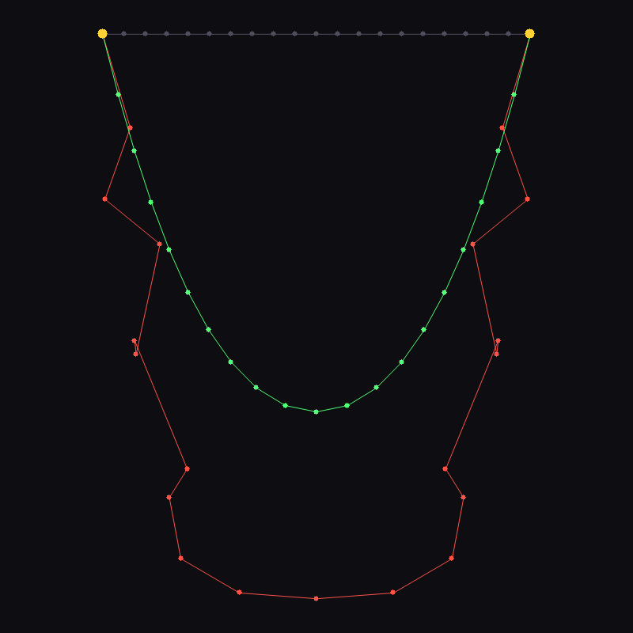
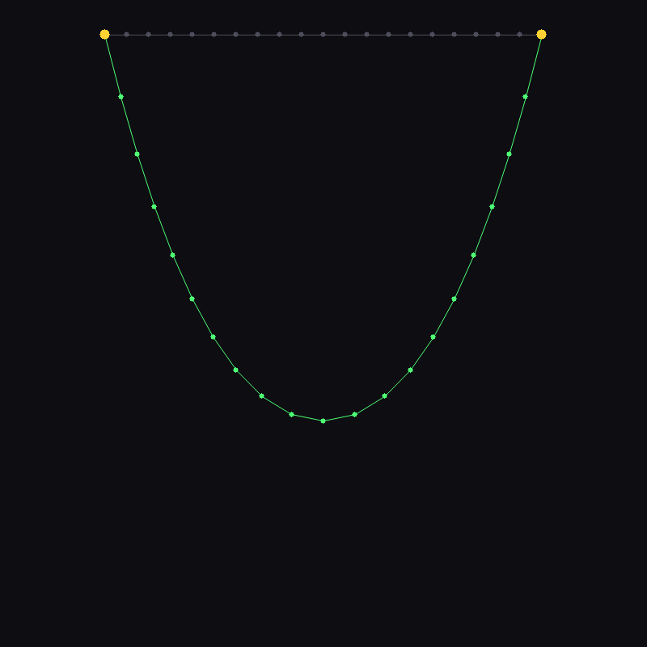

A rope of 21 point masses + Hooke springs, pinned at **both ends**, hanging under gravity
(k = 500, dt = 0.01, no substepping). Integrated three ways at *identical* parameters:

- **Explicit (forward) Euler** — **unstable**: energy pumps in every step, so the rope
  (red, left) blows up — `|disp|` crosses 10 by step 120, 1e6 by step 247, and goes
  **non-finite (≈1e30) by step 587**.
- **Semi-implicit (symplectic) Euler** — **stable**: advancing velocity *before* position
  keeps it bounded forever (max `|disp|` = 3.31 over 20 000 steps, never diverges), and with
  a little viscous damping it settles into the smooth **catenary** (green).
- **Verlet** — also settles to the **same** catenary; the two stable integrators agree to
  **sag = 1.7659** (4 decimal places), an independent cross-check.

The left image overlays the exploding explicit rope (red) on the settled semi-implicit
catenary (green); grey is the taut starting rope. This is the classic A8 result: explicit
Euler diverges, semi-implicit Euler and Verlet do not.

### A5 — Whitted ray tracing &nbsp;·&nbsp; A6 — BVH-accelerated mesh

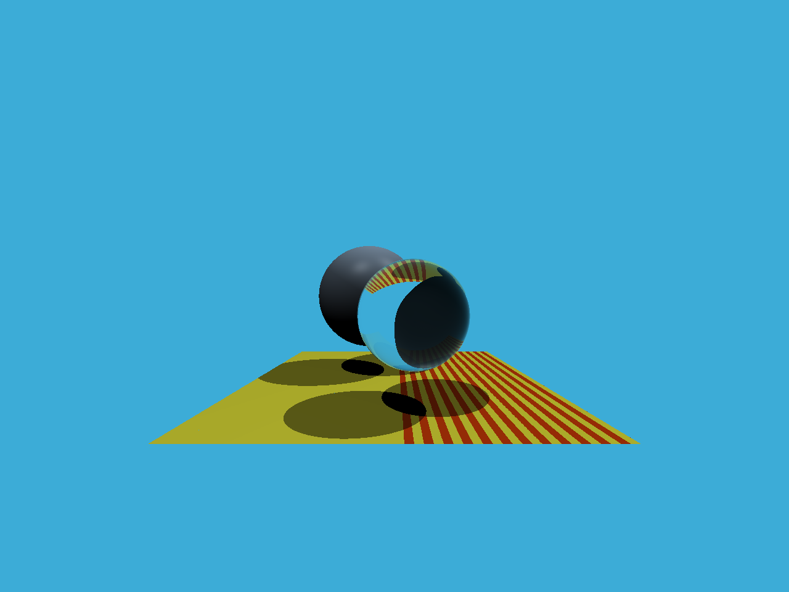
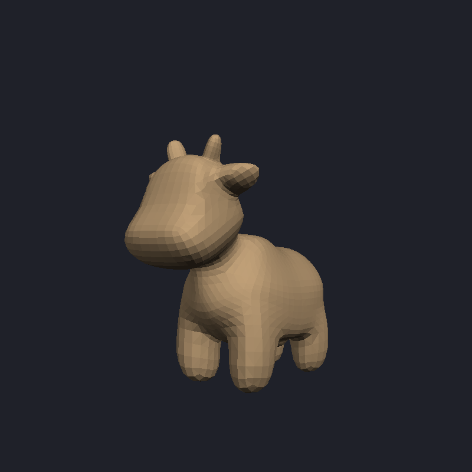

Glass sphere refracting the checkerboard with a Fresnel rim (A5); the 5856-triangle
Spot cow ray-traced through a BVH, **~200–470× faster** than linear intersection (A6).

### A3 — shading (normal · Blinn-Phong · texture · bump · displacement)

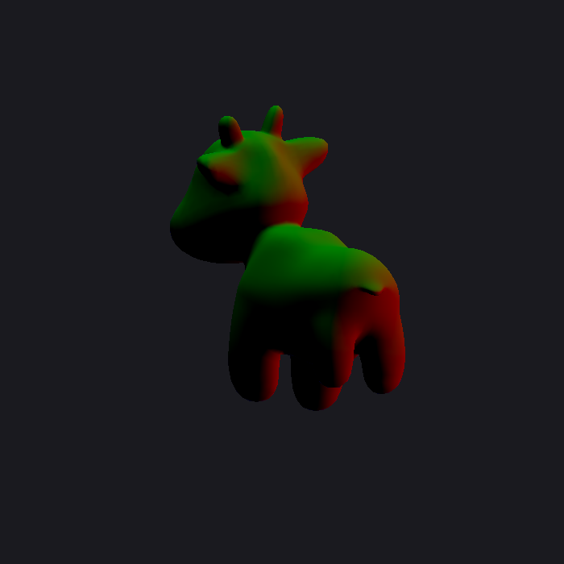
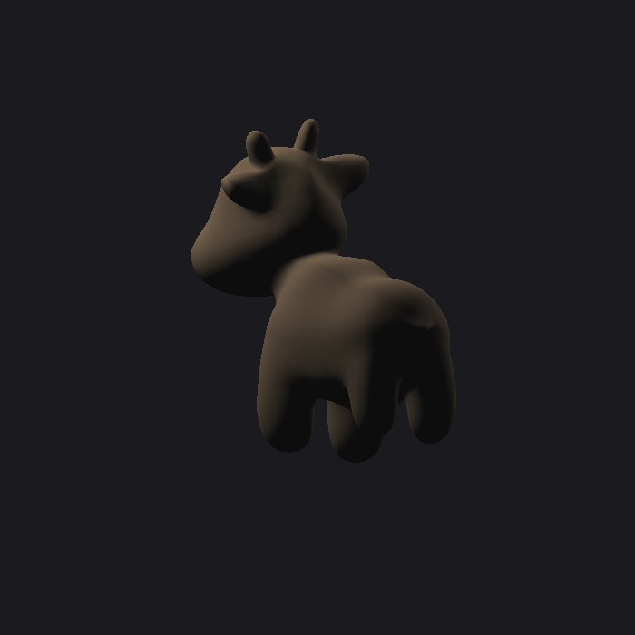
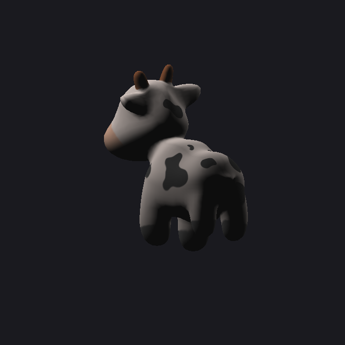
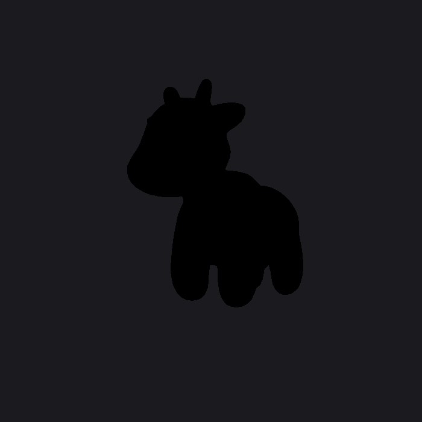
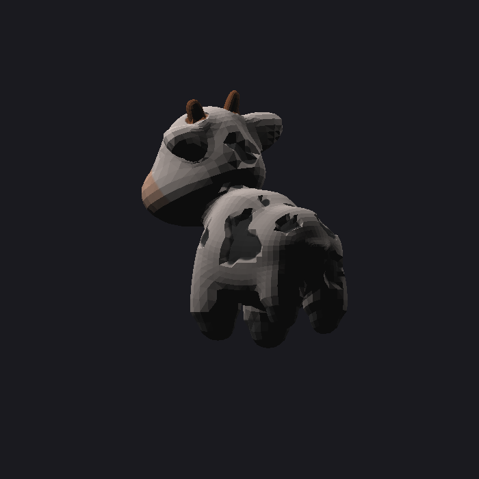

Left→right: interpolated normals, Blinn-Phong, textured Blinn-Phong, TBN bump from the
texture height-gradient, and **genuine geometry displacement** (vertices moved along the
normal by the height field, normals recomputed — note the lumpy silhouette).

### A1 — MVP triangle &nbsp;·&nbsp; A2 — rasterizer + MSAA &nbsp;·&nbsp; A4 — Bézier &nbsp;·&nbsp; A0 — transform

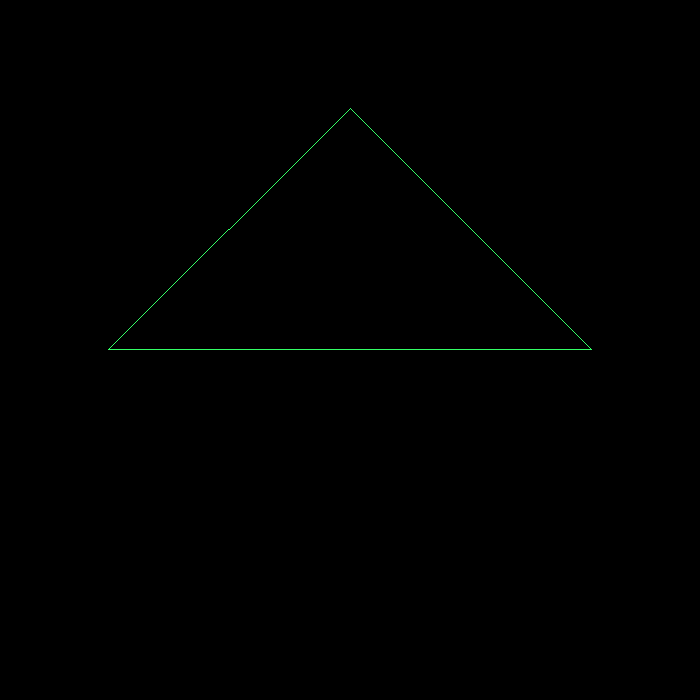
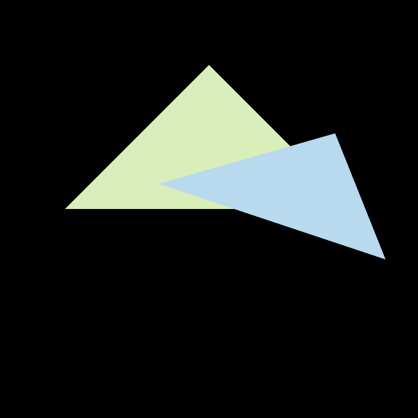
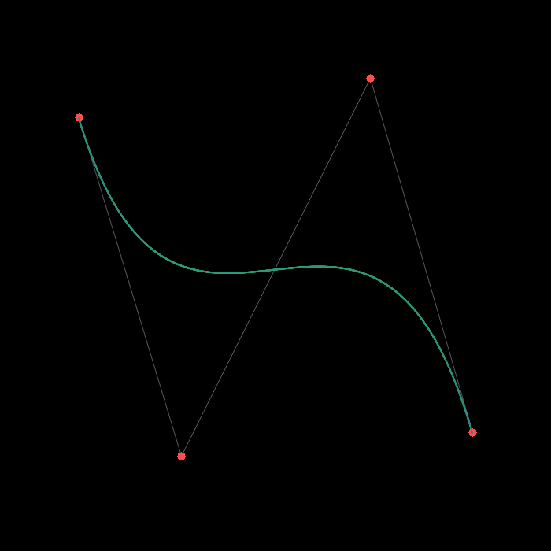
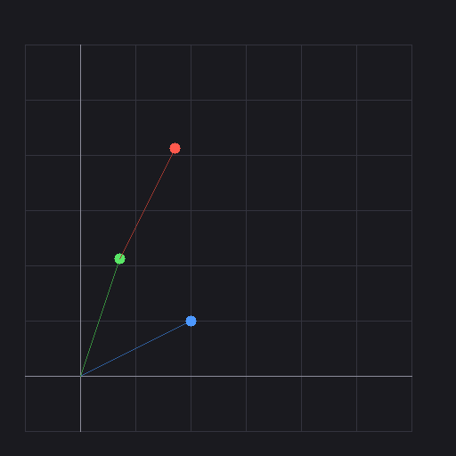

A2: the green triangle (z=−2) correctly occludes the blue one (z=−5) via the z-buffer.

## Implemented assignments

- [x] **A0 — Setup & transforms** — homogeneous 2D rotation+translation of a point, with a visualization.
- [x] **A1 — Model/View/Projection** — build M/V/P, perspective divide, viewport; rotate a triangle (+ arbitrary-axis Rodrigues bonus).
- [x] **A2 — Rasterization** — bounding-box + edge-function inside test, barycentric z-buffer, 2×2 MSAA.
- [x] **A3 — Shading** — Blinn-Phong (2 point lights) + texture + bump + displacement mapping on the Spot mesh.
- [x] **A4 — Bézier curves** — de Casteljau recursion, validated against the Bernstein form, anti-aliased.
- [x] **A5 — Whitted-style ray tracing** — ray-sphere + Möller–Trumbore, mirror/glass with Fresnel, hard shadows.
- [x] **A6 — BVH** — median-split bounding volume hierarchy with a measured speed-up over brute force.
- [x] **A7 — Path tracing** — Cornell box, Monte-Carlo global illumination with next-event estimation + Russian roulette.
- [x] **A8 — Mass-spring rope** — Hooke springs + gravity; explicit/semi-implicit Euler and Verlet integrators, showing explicit Euler diverges while the symplectic and Verlet schemes settle into a catenary.

## Project structure

```
games101/
├── assignments/          # one folder per assignment (a0..a8); a8 also has rope.h/rope.cpp
├── common/               # shared headers
│   ├── math_utils.hpp    # Eigen typedefs, RNG, helpers
│   ├── image.hpp         # linear-RGB framebuffer + PNG writer (stb)
│   ├── draw2d.hpp        # Bresenham / Wu lines, disks
│   ├── mesh.hpp          # OBJ loader + procedural sphere
│   ├── texture.hpp       # stb texture load + bilinear sampling
│   ├── rt_core.hpp       # Ray, Bounds3, Material, Sphere/Triangle, BVH
│   └── stb_impl.cpp      # single TU for the stb implementations
├── scripts/              # setup_deps, fetch_assets, build_all, run_all
├── results/              # committed rendered PNGs
├── third_party/          # (git-ignored) Eigen + stb, fetched by setup_deps
├── assets/               # (git-ignored) Spot model, fetched by fetch_assets
├── Makefile
└── LICENSE
```

## How to run

Prerequisite: a C++17 compiler (`g++` / MSYS2 on Windows, or gcc/clang on Linux/WSL2).
`cmake` and OpenCV are **not** required.

```bash
# 1. fetch header-only deps (Eigen 3.4.0 + stb) into third_party/
bash scripts/setup_deps.sh          # or: pwsh scripts/setup_deps.ps1

# 2. (optional) fetch the Spot cow model for A3/A6; both fall back to a
#    procedural sphere if it is absent, so this is not required.
bash scripts/fetch_assets.sh

# 3. build all nine assignments -> build/*.exe
bash scripts/build_all.sh           # or: mingw32-make   (make on Linux)

# 4. run them; each writes its PNG(s)/numbers into results/
bash scripts/run_all.sh
#    or individually, e.g.:
./build/a7.exe 256                  # path tracer, 256 samples/pixel
./build/a8.exe                      # rope sim; optional arg = spring stiffness k (default 500)
```

> **Windows note:** the build uses `-static-libgcc -static-libstdc++`. Without it, MSYS2's
> bfd linker crashes (`ld returned 116`) on the heavily-templated Eigen objects; static
> libstdc++ sidesteps the bad DLL import thunks. The flag is harmless on Linux/WSL2.

## Verification

Every assignment was run and its output inspected:

- **A0** matches the analytic result: rotate(45°)·(2,1)=(0.707,2.121), +translate(1,2)=(1.707,4.121).
- **A2** the near (green, z=−2) triangle occludes the far (blue, z=−5) one; MSAA blends 969 edge pixels.
- **A3** the `normal` and `bump` shaders now return a **concrete `Vec3f`** rather than a deduced Eigen
  expression: writing `return (v + Vec3f(1,1,1)) * 0.5f;` from an `auto` lambda kept a dangling reference
  to the temporary `Vec3f(1,1,1)`, so the caller read garbage (undefined behavior). The normal map came out
  red/green with **no blue channel** and the bump map rendered as an **all-black silhouette**. Forcing
  evaluation (`return Vec3f(...)`) fixes both: the normal map is now a smooth rainbow and the bump map shows
  the texture's height-field creases. Verified deterministic — rendering twice is byte-identical (MinGW
  g++ 14.2 and WSL2 g++ 13.3).
- **A4** de Casteljau and the closed-form Bernstein polynomial agree to **1.26e-4 px** over 2000 samples.
- **A6** BVH and brute-force intersection return **identical hit counts** (326/326 on the sample); BVH is
  ~200–470× faster and matches pixel-for-pixel.
- **A7** direct-only and full renders were compared to localize and fix a real shadow-visibility bug
  (the offset shadow-ray origin broke a squared-distance test, blacking out the red wall); the final
  image shows correct color bleeding and soft shadows.
- **A8** all three integrators run at *identical* (k, dt, gravity): explicit Euler diverges to
  **non-finite (~1e30) by step 587** (max `|disp|` > 10 by step 120, > 1e6 by 247), while
  semi-implicit Euler stays **bounded** (max `|disp|` = 3.31 over 20 000 steps) and both semi-implicit
  and Verlet independently settle to the **same catenary** — sag **1.7659** to four decimals — a
  cross-integrator agreement that confirms the physics. Numbers logged to `results/a8_rope.txt`.

All nineteen rendered PNGs are committed under `results/` (plus the A8 numeric log).

## Tech stack

C++17 · [Eigen 3.4](https://eigen.tuxfamily.org) (linear algebra) ·
[stb_image / stb_image_write](https://github.com/nothings/stb) (headless PNG I/O, replacing OpenCV) ·
OpenMP (path-tracer threading) · g++ 14.2. CPU-only, software-rendered.

## Key ideas / what I learned

- The rasterization pipeline end-to-end: homogeneous transforms, the perspective-projection
  matrix, perspective divide, viewport mapping, edge-function coverage, barycentric interpolation,
  z-buffering, and MSAA supersampling.
- Perspective-**correct** attribute interpolation (1/w weighting) for shading across triangles.
- Blinn-Phong plus the texture/bump/displacement family — including that displacement is *real
  geometry* while bump only perturbs the shading normal.
- Ray-primitive intersection (analytic sphere, Möller–Trumbore triangle) and Whitted recursion
  with the Fresnel term mixing reflection and refraction.
- BVH construction (centroid median split, AABB slab test) and the order-of-magnitude speed-up it buys.
- The Monte-Carlo rendering equation: importance sampling the light (next-event estimation),
  hemisphere sampling for indirect bounces, unbiased termination via Russian roulette.
- Time integration of a mass-spring system and why the update order matters: forward Euler
  injects energy and blows up, whereas symplectic (semi-implicit) Euler and Verlet are stable —
  the same rope, dt and stiffness settle into a catenary instead of exploding.

## Credits & license

Based on the assignments of **GAMES101 — Introduction to Computer Graphics** by
**Prof. Lingqi Yan** (course site: [games-cn.org/intro-graphics](https://games-cn.org/intro-graphics/)).
The [Spot](https://www.cs.cmu.edu/~kmcrane/Projects/ModelRepository/) model is by Keenan Crane
(fetched at runtime, not redistributed here). This repository is an independent educational
reimplementation; all course materials and assets belong to their original authors. Original
code here is released under the [MIT License](LICENSE).
